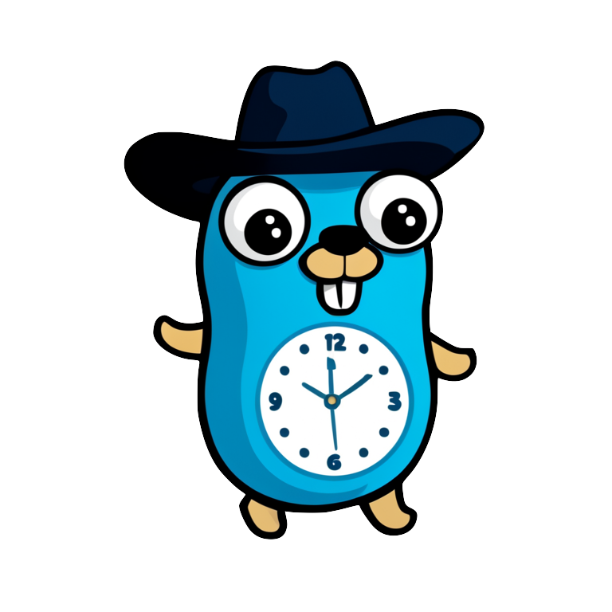

# Gohlay

The Kafka delayed message delivery tool.



Gohlay is a simple CLI tool that can produce messages on Kafka topics after a deadline that is set by a header on the message. This allows the original message producer to communicate a desired execution time for a consumer. Gohlay will republish the message exactly as it was sent removing the deadline header. A consumer will get the updated message and act on it.

Gohlay gives power to both the Producer and Consumer because it doesn't prevent either from acting in a normal manner. The Producer can send any messages without a deadline header and the Consumer can choose to ignore the deadline header.

## Try it out

Run the [Quickstart](./examples/quickstart/) compose example to see Gohlay in action. The following script will download and run the quickstart with the lates Gohlay version or you can copy and run the [compose.yaml](./examples/quickstart/compose.yaml) yourself.

```bash
wget -qO- https://github.com/vordimous/gohlay/releases/latest/download/startup.sh | sh -
```

## Install

Download the binary for your OS from the [latest Gohlay release](https://github.com/vordimous/gohlay/releases/latest).

Run Gohlay in a container:

```bash
docker run --rm ghcr.io/vordimous/gohlay --help
```

## Roadmap

- [X] Config with flags, yaml, and Environment vars
- [X] configurable header names
- [ ] configurable group id
- [ ] Kafka SASL auth
- [ ] Deliver to multiple topics
- [ ] Use a configurable offset to start from
- [ ] Deliver all message
- [ ] Native CRON trigger
- [ ] Tested Kafka 2.x and 3.x support
