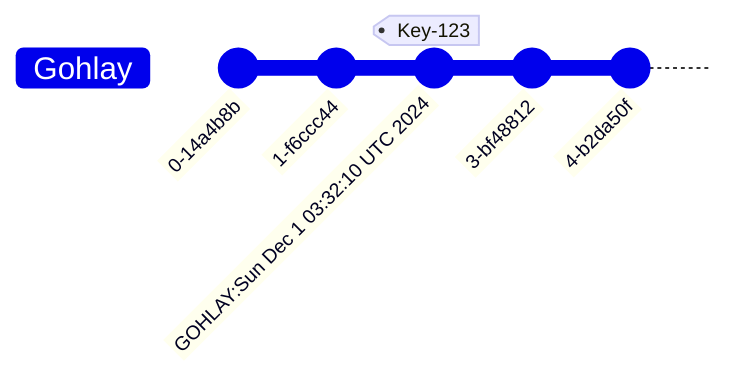
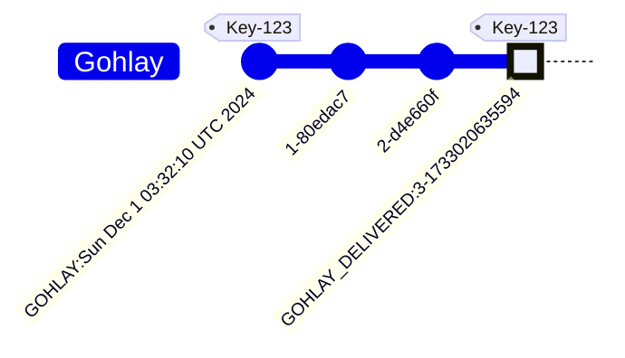

# Gohlay

The Kafka message scheduling tool.


Gohlay is a low-impact tool to add scheduled messages to a Kafka workflow. It is a simple CLI tool that reproduces messages on Kafka topics after a delivery time set by a header on the message. This allows the original message producer to communicate a desired execution time for a consumer. Gohlay will republish the message exactly as it was sent, removing the delivery time header. A consumer will get the updated message and can decide to act on it.

Gohlay doesn't prevent either the Producer or Consumer from acting normally. The Producer can send any messages without a delivery time header, and the Consumer can choose to ignore the delivery time header.

Benefits:

- Lightweight and low memory usage. Gohlay only reads the message metadata.
- Run it on a cron or scheduled containers. The more frequently Gohlay is run the closer to the scheduled time the message will be delivered.
- A full run only takes ~3s even for large topics, kafka connection times take the longest.
- Fault tolerant. If Gohlay is interrupted a new run will pick up any undelivered messages.

Gohlay topic:

- Can be log compacted to reduce extra processing.
- Topic retention policy dictates how long scheduled messages are allowed to be delivered
- Number of partitions and rebalanced doesn't affect Gohlay

## Try it out

Run the [Quickstart](./examples/quickstart/) compose example to see Gohlay in action. The following script will download and run the Quickstart with the latest Gohlay version or you can copy and run the [compose.yaml](./examples/quickstart/compose.yaml) yourself.

```bash
wget -qO- https://github.com/vordimous/gohlay/releases/latest/download/startup.sh | sh -
```

or any of the [examples](./examples/) by the folder name:

```bash
wget -qO- https://github.com/vordimous/gohlay/releases/latest/download/startup.sh | sh -s -- folder-name
```

## Install

Download the binary for your OS from the [latest Gohlay release](https://github.com/vordimous/gohlay/releases/latest).

Run Gohlay in a container:

```bash
docker run --rm ghcr.io/vordimous/gohlay --help
```

```text
Gohlay is a message scheduling tool for producing messages onto
Kafka topics on a schedule set by a Kafka message header.

Usage:
 gohlay [flags]
 gohlay [command]

Available Commands:
 check       Check for gohlayed messages that are past the deadline
 completion  Generate the autocompletion script for the specified shell
 help        Help about any command
 run         Check for gohlayed messages and deliver them.

Flags:
 -b, --bootstrap-servers stringArray                          Sets the "bootstrap.servers" property in the kafka.ConfigMap (default [localhost:9092])
 --config-dir string                                      config file directory. (default ".")
 -d, --deadline int                                           Sets the delivery deadline. (Format: Unix Timestamp) (default 1733013640995)
 --debug                                                  Display debugging output in the console.
 -h, --help                                                   help for gohlay
 --json                                                   Display output in the console as JSON.
 -p, --kafka-properties property=value                        Sets the standard librdkafka configuration properties property=value documented in: https://github.com/confluentinc/librdkafka/tree/master/CONFIGURATION.md
 -o, --override-headers default_header_name=new_header_name   Maps the name of default headers to a custom header default_header_name=new_header_name. ex: `GOHLAY=DELAY_TIME`
 --silent                                                 Don't display output in the console.
 -t, --topics stringArray                                     Sets the kafka topics to use (default [gohlay])
 -v, --verbose 
```

## How Gohlay works

Gohlay will scan the configured Kafka topic and look for messages with the `GOHLAY` header. It checks the delivery time in the header and ignores any messages with a delivery time later than the configured deadline. Gohlay finishes a full scan of the topic and stores only a pointer to any deliverable messages.



When it finds a message to deliver, Gohlay scans the topic again and looks only for the messages it knows should be delivered. When it finds a deliverable message, it produces the message for the topic it is scanning. This completes the delivery, and a Kafka client can react to the delivered message.



With both messages on the same topic, Gohlay can determine that a message has already been delivered when it checks for new deliveries. A Kafka producer can decide to send messages with or without the `GOHLAY` header, and a Kafka consumer can choose to wait for the `GOHLAY_DELIVERED` message or process the initial message payload and execute an additional workflow when it is delivered.

## Roadmap

- [X] Config with flags, yaml, and Environment vars
- [X] A configurable header names
- [ ] A configurable group id
- [X] Kafka SASL auth
- [ ] Deliver to multiple topics
  - [ ] from cli arg
  - [ ] from message header
- [ ] Use a configurable offset to start from
- [ ] Support relative delivery times (ex: "+ 30 min")
- [ ] Deliver all messages
- [ ] Simple delivery time update/cancel
- [ ] Native CRON trigger
- [ ] Tested Kafka 2.x and 3.x support
- [ ] More install options
